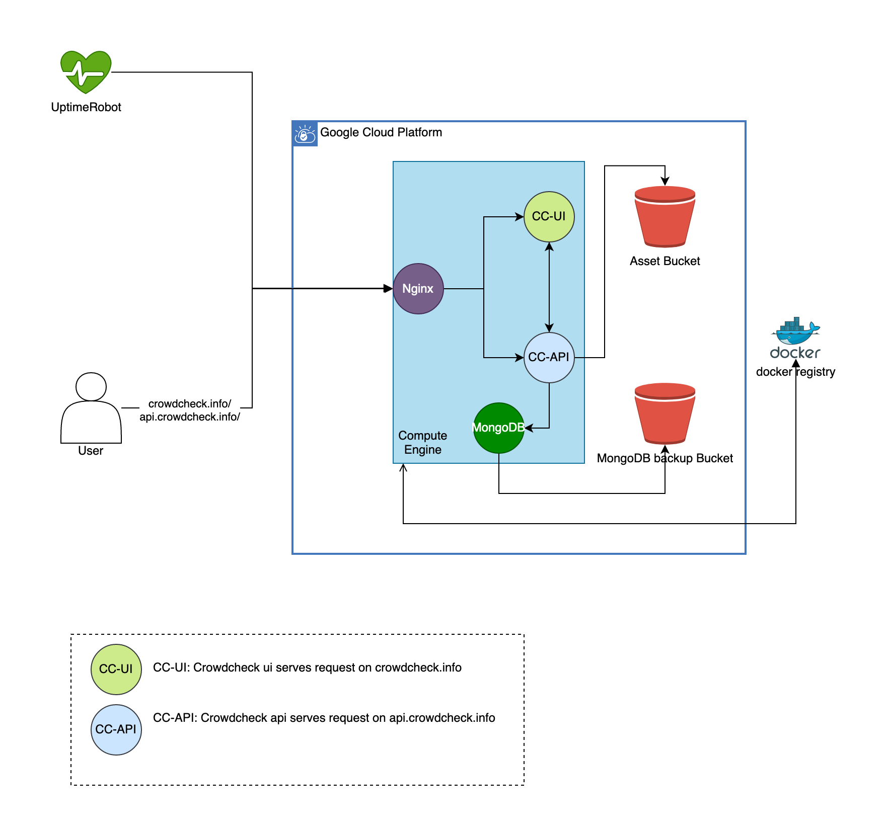

# CrowdCheck Server Document

### System component ⚙️

- Nginx
- CroweCheck UI
- CrowCheck API
- MongoDB
- GCS Bucket for assets
- GCS Bucket for MongoDB Backup
- Docker Registry
- Uptime Robot

### System Diagram 🌐

We are using container to host our applicaion. They are 4 containers as can see from above diagram

- `Nginx` is the component to handled network traffic routing and encryption(SSL/TLS)
- `Crowdcheck UI` Frontend applicaion serving request for [crowdcheck.info](http://crowdcheck.info)
- `Crowdcheck API` Backend applicaion handle api request, connecting to `MongoDB` and `Assets Bucket` for file upload.
- `MongoDB` NoSQL database

Crowdcheck UI/API container images are stored on docker hub(`docker registry`)

Monitoring and Backup 🏥

- Database backup is done by cronjob which sending backup to GCS bucket (`MongoDB Backup Bucket`)
- `UptimeRobot` monitoring uptime of our applicaions and sending notification if server down detected